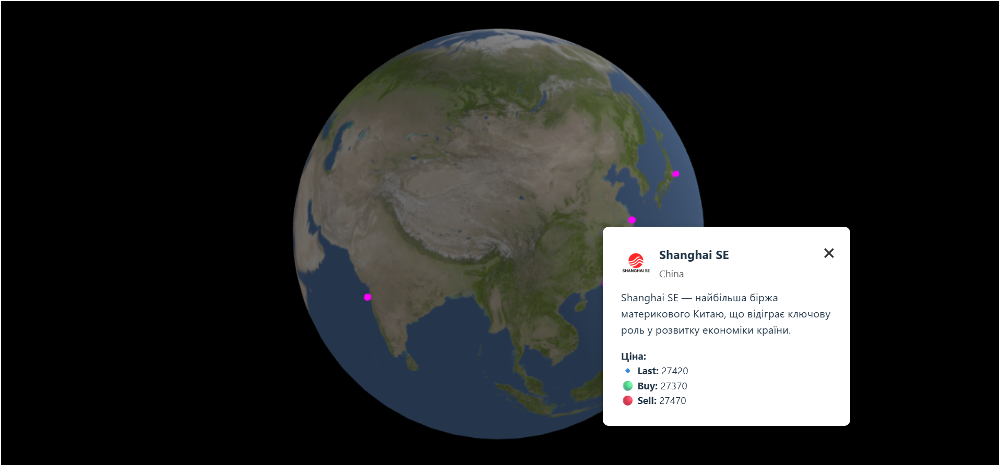

# 🌐 Macroglide Globe

Інтерактивна 3D-візуалізація глобуса з позначенням ключових фондових бірж світу. Кожна біржа представлена з логотипом, коротким описом та актуальними торговими даними.

**Frontend playground** побудований на [Vite](https://vitejs.dev/) та [react-three-fiber](https://github.com/pmndrs/react-three-fiber) — для 3D-візуалізацій у браузері.

**Мета:** Візуалізація глобальних макроекономічних показників у інтерактивному форматі

---

## 🚀🛠️ Технології

- [x] `Three.js` або `CesiumJS` — для 3D-глобуса
- [x] `Vite`
- [x] `React` / `Vue` — для UI
- [x] `TypeScript` (опціонально)
- [x] `TailwindCSS` / `Styled Components`
- [x] `Axios` / `Fetch API` — для отримання біржових даних
- [x] `D3.js` або `Chart.js` (для графіків)
- [x] `GeoJSON` — для географічного розташування точок

---

## 📦 Встановлення

```bash
git clone https://github.com/your-username/macroglide-globe.git
cd macroglide-globe
npm install
npm run dev
```

---

## 📁 Структура

```plaintext
macroglide-globe/
├── public/                          # Статичні файли, доступні напряму з браузера
│   ├── logos/                       # Логотипи бірж (PNG)
│   │   └── logo.png
│   ├── models/                      # 3D-моделі для Three.js (GLB, GLTF)
│   │   └── earth.glb
│   ├── earth_texture.jpeg          # Текстура глобуса
│   └── favicon.png                 # Іконка сайту (відображається у вкладці браузера)
│
├── screenshots/                    # Прев’ю або знімки екрану для README / соцмереж
│   └── globe.png
│
├── src/                            # Вихідний код додатку
│   ├── assets/                     # Локальні медіа-файли (текстури, іконки, 3D)
│   │   ├── earth.usdz              # Альтернативна модель Землі (для AR)
│   │   ├── earthmap4k.jpg          # Високоякісна текстура Землі
│   │   └── react.svg               # Логотип React
│
│   ├── components/                 # UI-компоненти та логіка сцени
│   │   ├── ExchangeMode.jsx        # Компонент перемикання режимів бірж
│   │   ├── ExchangeDot.jsx         # Візуалізація точок бірж на глобусі
│   │   ├── ExchangeObj.tsx         # Альтернативне представлення біржі (через об'єкт)
│   │   └── GlobeScene.jsx          # Основна сцена: глобус, точки, світло, камера
│
│   ├── data/                       # Статичні дані та типи
│   │   ├── Types/                  # Типи TypeScript для бірж
│   │   │   └── Exchange.ts
│   │   └── exchanges.ts            # Масив бірж з координатами та метаданими
│
│   ├── utils/                      # Допоміжні функції
│   │   └── utils.js                # Конвертація координат, обробка даних
│
│   ├── App.css                     # Глобальні стилі або Tailwind-конфігурація
│   ├── App.jsx                     # Головний компонент додатку
│   ├── index.css                   # Базові стилі для index.html
│   └── main.jsx                    # Точка входу в React-додаток
│
├── .gitattributes                  # Налаштування Git для кодування, diff тощо
├── .gitignore                      # Ігноровані файли (наприклад, node_modules, .env)
├── eslint.config.js                # Конфігурація ESLint для перевірки коду
├── index.html                      # HTML-шаблон для Vite
├── LICENSE                         # Ліцензія проєкту
├── package-lock.json               # Автоматично згенерований файл залежностей
├── package.json                    # Список залежностей, скрипти, мета-дані проєкту
├── README.md                       # Документація: опис, інструкції, посилання
├── tsconfig.json                   # Налаштування TypeScript
└── vite.config.js                  # Конфігурація Vite: білд, базовий шлях, плагіни
```

---

## 🧠 Функціонал

- 🌍 Інтерактивна карта світу
- 🔍 Пошук країн та регіонів
- 📍 Відображення бірж на глобусі (магентові точки)
- 🏢 Інформаційні поп-апи з логотипом, описом та цінами
- 📊 Відображення економічних даних у вигляді графіків (опціонально)
- 📁 Експорт даних у CSV
- 🧩 Центрування на регіон (наприклад, Азія)
- 🔄 Оновлення даних у реальному часі (опціонально)

---

## 📌 TODO

- [ ] Анімації переходів між сценами
- [ ] Інтеграція з API для динамічних даних
- [ ] Збереження обраних країн
- [ ] Авторизація користувачів
- [ ] Збереження стану користувача
- [ ] Темна тема

---

## 📑 Ліцензія та авторські права

MIT — вільне використання з зазначенням авторства.

Цей проєкт використовує [NASA Earth Textures](https://blenderartists.org/t/8k-earth-texture-download-free/1193918) та інші публічні ресурси - [James Hastings-Trew](https://planetpixelemporium.com/earth.html) згідно з ліцензією [CC BY 4.0](https://blenderartists.org/t/8k-earth-texture-download-free/1193918).

---

### 🇨🇳 Приклад: Shanghai Stock Exchange

> **Shanghai SE** — найбільша біржа материкового Китаю, що відіграє ключову роль у розвитку економіки країни.

**Торгові дані:**

- 🔹 Остання ціна: `27420`
- 🟢 Купівля: `27370`
- 🔴 Продаж: `27420`

## 🌍🖼️ Візуалізація глобуса з біржами

[](./screenshots/globe.png)

---

## 🌐 Онлайн версія

Переглянути сайт: [MACROGLIDE Globe](https://fotinia-sadovskaya.github.io/macroglide-globe/)
